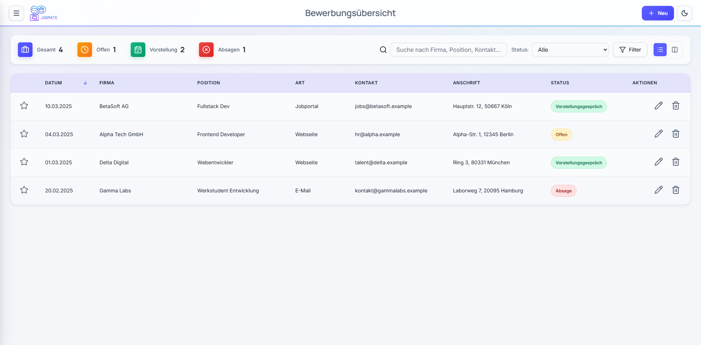

# Jobmate

Jobmate ist eine lokale Web-App zur strukturierten Verwaltung von Bewerbungen.
Das Projekt zeigt einen klaren Produktfokus: schneller Datenzugriff, saubere
Statusführung, nachvollziehbare Historie und einfache Exportwege.

## Screenshot



## Kurzprofil

- Single-Page-Application ohne Framework (Vanilla JavaScript).
- Saubere Trennung von UI, Zustand, Persistenz und Rendering.
- Responsives UI mit Desktop- und Mobile-Flow.
- Datengetriebene Features: Filter, Sortierung, Statistik, Follow-up-Logik.
- Lokale, datenschutzfreundliche Speicherung via `localStorage`.

## Kernfunktionen

- Bewerbungen anlegen, bearbeiten, löschen und als Favorit markieren.
- Ansichten:
  - Tabelle (sortierbar)
  - Mobile Karten
  - Kanban-Board mit Drag-and-Drop
- Suche und Filter:
  - Volltextsuche
  - Statusfilter
  - Follow-up-Filter
  - Favoritenfilter
- Detaildaten pro Bewerbung:
  - Notizen
  - Dokumente
  - Termine
  - Links
  - Timeline-Ereignisse
- Statistiken:
  - Aktivität nach Zeitraum
  - Erfolgs- und Absagequote
  - Bewerbungskanäle
  - Anstehende Termine
- Exporte:
  - PDF-Export über `template.pdf`
  - JSON-Backup/Restore (inkl. Einstellungen)
- UX:
  - Dark Mode
  - Toast-Benachrichtigungen
  - Hilfe-Seite mit Quickstart und FAQ

## Tech Stack

- HTML5
- CSS3 (Design Tokens, Responsive Layout, Dark Mode)
- Vanilla JavaScript (ES6+)
- [Lucide Icons](https://lucide.dev/) via CDN
- [pdf-lib](https://pdf-lib.js.org/) via CDN

## Projektstruktur

- `index.html`: App-Struktur, Seiten, Formulare, Modals.
- `script.js`: Zustand, Rendering, Interaktionen, Persistenz, Export/Import.
- `style.css`: Visuelles System, Responsive Verhalten, Komponenten.
- `template.pdf`: Vorlage für PDF-Export.
- `debug.js`: Hilfsskript für DOM-Debugging.

## Lokal starten

Da der PDF-Export `fetch('template.pdf')` nutzt, sollte die App über einen
lokalen HTTP-Server gestartet werden.

### Option 1: Python

```bash
python -m http.server 8080
```

### Option 2: Node (serve)

```bash
npx serve .
```

Danach im Browser öffnen:

- `http://localhost:8080` (Python)
- bei `serve`: Terminal-Ausgabe beachten (oft `http://localhost:3000`)

## Datenhaltung

Die App speichert lokal im Browser:

- `jobmate-entries-v8`
- `jobmate-settings`
- `jobmate-theme`
- `jobmate-last-notification-check`

Keine Server-Komponente, keine externe Datenbank.

Es werden keine Daten an Server übertragen und keine Drittanbieter-Tracker genutzt.

## Technische Highlights

- Datenmigration für ältere Einträge (`migrateDates`, `migrateEntries`).
- Defensive Programmierung bei optionalen Feldern und Parsing.
- Escape-Helfer zur sicheren Ausgabe dynamischer Inhalte.
- Einheitliches Rendering für mehrere Darstellungsmodi.

## Einschränkungen

- Keine automatisierten Tests im aktuellen Stand.
- Reine Frontend-App ohne User-Accounts oder Sync zwischen Geräten.

## Kontakt

- Name: Michael Weißgerber
- E-Mail: michael [at] polarco.de
- Webseite: https://polarco.de

## Lizenz

Dieses Projekt steht unter der MIT-Lizenz. Details siehe [LICENSE](LICENSE).
